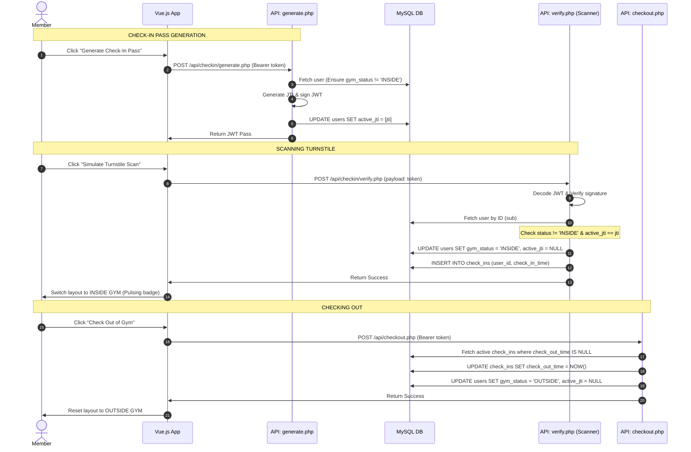

# Secure Gym Check-In and Checkout System

We have implemented a complete Secure Gym Check-In system with a frontend simulation dashboard in Vue.js and a secure, OOP-based PHP backend using PDO and JWT.

---

## 1. Architecture Flow Diagram



---

## 2. File Directory and Created Components

### Backend Endpoints
- **Auth Helper** ([auth.php](file:///c:/laragon/www/JTW_authentication/backend/helpers/auth.php)): Reusable helper that extracts the Bearer token from headers, verifies it with `JWT::decode`, and returns the payload.
- **Generate Pass** ([generate.php](file:///c:/laragon/www/JTW_authentication/backend/api/checkin/generate.php)): Validates session, checks that the user's `gym_status` is `OUTSIDE`, generates a unique `jti`, creates the JWT pass, updates the user's `active_jti` in MySQL, and returns the JWT.
- **Verify Pass** ([verify.php](file:///c:/laragon/www/JTW_authentication/backend/api/checkin/verify.php)): Simulates the scanner. Verifies the token signature, checks that the user's `gym_status` is not already `INSIDE`, checks that `active_jti` matches the token's `jti`, logs the check-in time in `check_ins`, updates the status to `INSIDE`, and invalidates the pass (`active_jti = NULL`).
- **Checkout** ([checkout.php](file:///c:/laragon/www/JTW_authentication/backend/api/checkout.php)): Validates session, updates the active `check_ins` log with the `check_out_time`, and sets `gym_status = 'OUTSIDE'`.

### Frontend Component
- **Check-In Simulator** ([GymCheckInSimulator.vue](file:///c:/laragon/www/JTW_authentication/jwt_project/src/components/GymCheckInSimulator.vue)): A premium card component mimicking a mobile screen presenting a QR code with scanning animation and turnstile trigger.
- **Dashboard Integrations** ([MemberDashboardView.vue](file:///c:/laragon/www/JTW_authentication/jwt_project/src/views/MemberDashboardView.vue) and [AdminDashboardView.vue](file:///c:/laragon/www/JTW_authentication/jwt_project/src/views/AdminDashboardView.vue)): Renders the simulator and displays the real-time `Gym Location Status` in the user profiles.

## 3. QR Code Generation System

To keep the frontend bundle size lightweight and dependency-free, the application does not install local NPM packages (like `qrcode` or `vue-qrcode`). Instead, it uses a free, public QR Code API provided by **goqr.me** to render the check-in passcode dynamically.

### 3rd Party Service Details
- **Provider**: [goqr.me API](https://goqr.me/api/)
- **Base Endpoint**: `https://api.qrserver.com/v1/create-qr-code/`
- **Request Method**: `GET` (returns a dynamic PNG/SVG image stream directly in the `` `src` attribute)

### Dynamic Image URL Configuration
The simulator binds the `:src` attribute dynamically inside the template:
```html

```

#### Query Parameters Breakdown:
- **`size=160x160`**: Generates a square QR code image of `160px` by `160px` fitting the simulator smartphone screen.
- **`color=210-252-0`**: Customizes the color of the QR modules (foreground) in R-G-B format. `210, 252, 0` corresponds to the gym's brand Volt color (`#d2fc00`).
- **`bgcolor=17-17-19`**: Customizes the background of the image in R-G-B format. `17, 17, 19` corresponds to the gym app card background (#111113), allowing the QR code to blend seamlessly into the dark theme.
- **`data=encodeURIComponent(qrToken)`**: The payload string to be encoded (the signed JWT). Since JWTs contain standard dots (`.`), hyphens (`-`), and underscores (`_`), `encodeURIComponent` guarantees that the JWT is safely serialized without breaking URL query parameters.
